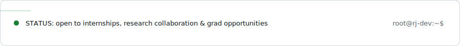

<picture>
  <source media="(prefers-color-scheme: dark)" srcset="assets/dark/header.svg"/>
  
</picture>

<a href="https://finalportfolio-chi-bay.vercel.app"><picture><source media="(prefers-color-scheme: dark)" srcset="https://img.shields.io/badge/PORTFOLIO-0d1117?style=flat-square&logoColor=ffffff"/></picture></a>
<a href="https://www.linkedin.com/in/muhammad-rahim-jamil-39906622b/"><picture><source media="(prefers-color-scheme: dark)" srcset="https://img.shields.io/badge/LINKEDIN-0d1117?style=flat-square&logo=linkedin&logoColor=ffffff"/></picture></a>
<a href="mailto:mjamil.ce45ceme@student.nust.edu.pk"><picture><source media="(prefers-color-scheme: dark)" srcset="https://img.shields.io/badge/EMAIL-0d1117?style=flat-square&logo=gmail&logoColor=ffffff"/></picture></a>

 

<picture>
  <source media="(prefers-color-scheme: dark)" srcset="assets/dark/whoami.svg"/>
  
</picture>
  

<picture>
  <source media="(prefers-color-scheme: dark)" srcset="assets/dark/systems.svg"/>
  
</picture>

Python · PyTorch · TensorFlow · OpenCV · FastAPI · Flask · MLflow · Docker · GitHub Actions · Streamlit · Plotly · n8n · C++ · C · Dart
  

### `03 — BUILDS`

**🚨 [Gaon Guard AI](https://github.com/Rahim36712/gao_ai)**
11-agent crisis-response system (Google Antigravity hackathon build). Cross-verifies disaster reports across 5 data sources, dispatches teams via Haversine routing, flags aid fraud in real time.
`Python` `FastAPI` `Firebase`

**🧠 [Brain Tumor Segmentation (3D)](https://github.com/Rahim36712/Brain-Tumor-Segmentation-3D)**
3D U-Net / Attention U-Net on BraTS — **89% Dice score**. Full pipeline from preprocessing through Grad-CAM explainability, plus a Streamlit inference app.
`PyTorch` `Streamlit`

**🚗 [Self-Driving Car Simulation](https://github.com/Rahim36712/self-driving)**
Classical-CV lane detection fused with YOLOv8 object detection on dashcam video via a rule-based decision engine. Multi-threaded, sustains **15+ FPS** with a 6-panel debug view.
`OpenCV` `YOLOv8`

**📊 [GitHub Insights Dashboard](https://github.com/Rahim36712/github-dashboard)**
Streamlit analytics app pulling the GitHub REST API for repo comparisons, language breakdowns, star growth, and contributor leaderboards.
`Streamlit` `Plotly`

**🎵 [Automated Song Downloader](https://github.com/Rahim36712/N8N_SONG-_DOWNLOADING_AUTOMATION)**
n8n + Python pipeline batch-downloading from YouTube/Spotify with concurrent threads, deduplication, and a Flask GUI.
`n8n` `Flask`

**📉 [ML Model Drift Monitor & Auto-Retraining Platform](https://github.com/Rahim36712/ML-Model-Drift-Monitoring-Automated-Retraining-Platform)**
Self-healing MLOps loop: PSI/KL/Hellinger drift detection triggers champion-vs-challenger retraining, with automatic MLflow promotion and Slack/email alerting.
`FastAPI` `MLflow` `Plotly Dash`

 

### `04 — TELEMETRY`

<picture>
  <source media="(prefers-color-scheme: dark)" srcset="https://github-readme-stats.vercel.app/api?username=Rahim36712&show_icons=true&theme=dark&hide_border=true&count_private=true"/>
  
</picture>
<picture>
  <source media="(prefers-color-scheme: dark)" srcset="https://github-readme-stats.vercel.app/api/top-langs/?username=Rahim36712&layout=compact&theme=dark&hide_border=true"/>
  
</picture>

the contribution graph has a snake living in it — click to see it

 

<picture>
  <source media="(prefers-color-scheme: dark)" srcset="https://raw.githubusercontent.com/Rahim36712/Rahim36712/output/github-contribution-grid-snake-dark.svg" />
  <source media="(prefers-color-scheme: light)" srcset="https://raw.githubusercontent.com/Rahim36712/Rahim36712/output/github-contribution-grid-snake.svg" />
  
</picture>

 

<picture>
  <source media="(prefers-color-scheme: dark)" srcset="assets/dark/timeline.svg"/>
  
</picture>
  

<picture>
  <source media="(prefers-color-scheme: dark)" srcset="assets/dark/footer.svg"/>
  
</picture>
